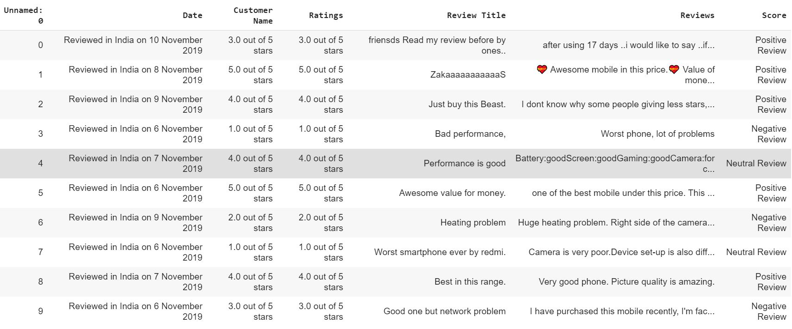
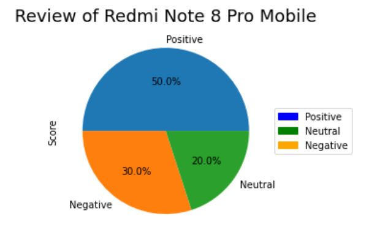

# Amazon Web Scraping of Redmi Note 8 Pro Mobile
* Import Url from amazon
* Import BeautifulSoup for Web-Scraping
* Using soup to collect data by inspect the amazon web page
* Gathering data and storing it in DataFrame using Panda Library
* Exporting the dataframe into csv file

# Sentiment Analysis
* Importing vader-lexicon from SentimentAnalyzer
* Finding the Polarity Score
* Comparing the Compound Values and storing it in the Score as positive,negative,neutral review score

# Data Visualization
* Import pie chart from matplotlib
* Visualizing the Score column using Pie Chart

